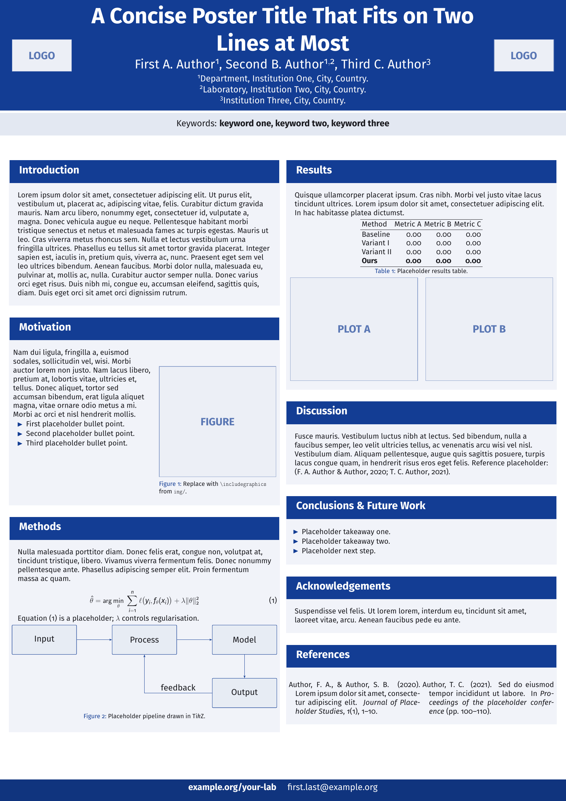

# A0 Poster Template

Portrait A0 scientific poster, `beamerposter` + Fira Sans.

  

    make        # build/main.pdf
    make watch  # rebuild on save
    make view   # build and open
    make clean

Needs TeX Live with `latexmk`, `beamerposter`, `FiraSans`, `apacite`, `lipsum`.

Edit `main.tex`. The theme lives in `theme/beamerthemesimpleposter.sty`; the
Makefile puts it on `TEXINPUTS`, so it does not need to be in the root.

## Knobs

Accent colour drives the header, block titles and footer. Set it in `main.tex`
after `\usetheme`:

    \definecolor{posteraccent}{RGB}{19,61,148}

Logos and footer are `\renewcommand` hooks, not hardcoded in the theme:

    \renewcommand{\posterleftlogo}{\includegraphics[width=0.75\linewidth]{logo.pdf}}
    \renewcommand{\posterrightlogo}{\includegraphics[width=0.75\linewidth]{logo2.pdf}}
    \renewcommand{\posterfooter}{example.org \quad first.last@example.org}

`\placeholderbox{<width>}{<height>}{<label>}` draws a grey box standing in for a
figure, so the poster compiles before you have any.
